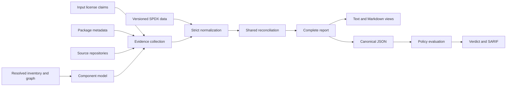

# Ol Architecture

This document describes the architecture that realizes the principles in [DESIGN.md](DESIGN.md). User-facing contracts for individual features are documented in [specs/](specs/).

## Scope

Ol turns a resolved dependency inventory and multiple license-evidence sources into an explainable report, then evaluates that persisted report under an explicit policy. An SBOM is one inventory input, not the whole system.

Ol does not provide legal advice or claim legal certainty. It preserves uncertainty, disagreement, and collection failures instead of guessing.

## Non-Goals

- Inferring legal compatibility or obligations beyond configured policy.
- Guessing precise SPDX identifiers from vague natural-language text.
- Treating one evidence source as universally authoritative.
- Hiding unknown, ambiguous, invalid, conflicting, deprecated, or unavailable evidence.
- Performing policy enforcement during evidence collection or reconciliation.
- Producing redistribution artifacts such as `THIRD-PARTY-NOTICES`, attribution files, or license bundles. Producing those artifacts requires choices and completeness claims that do not follow from observed evidence alone.

## Architectural Decisions

The following decisions connect the design principles to observable specifications.

| Decision | Rationale | Contract |
|---|---|---|
| Resolve the complete inventory before filtering. | Early filtering can erase graph context or transitive OSS use. | [Dependency type and filtering](specs/cli.md#contract-dependency-filtering) |
| Preserve evidence instead of selecting one source. | Sources can be absent, stale, inferred, or wrong; disagreement is itself relevant. | [Component status](specs/cli.md#contract-component-status) and source-specific evidence specs |
| Let inputs combine rather than compete. | This principle applied to collected evidence but not to the inputs themselves: an SBOM and a package-manager input were alternatives, so each scan was capped at whatever one of them happened to know, and their disagreements were unobservable. | [Input combination](specs/cli.md#contract-input-combination) and [component supply](specs/cli.md#contract-component-supply) |
| Normalize only against versioned SPDX data. | Reproducible results require stable identifiers and semantics. | [SPDX normalization](specs/spdx.md#contract-spdx-normalization) |
| Prefer explicit SPDX selection with an offline fallback. | A specific environment must be reproducible without making ordinary scans depend on a network. | [SPDX data resolution](specs/spdx.md#contract-spdx-data-resolution) |
| Separate factual resolution from organizational policy. | The same facts may be acceptable under one policy and rejected under another. | [`check`](specs/cli.md#contract-policy-checks) |
| Make source failures best-effort and command failures explicit. | One unavailable source must not hide other dependencies, but an incomplete report must not look trustworthy. | [Scan failures](specs/cli.md#contract-scan-failures) |
| Use canonical JSON with human-oriented projections. | Automation needs a stable complete model; reviewers need compact views of the same result. | [Output formats](specs/cli.md#contract-output-formats) |
| Make evidence freshness explicit. | An implicit TTL makes behavior depend on wall-clock time. | Package and source cache specifications |
| Version persistent evidence formats. | Upgrades must not silently reinterpret durable cache data. | [Cache compatibility](specs/cache_format.md#compatibility-contract) |
| Bound external I/O and retry only transient failures. | Dependency count must not create uncontrolled load or waste shared-service limits. | Package and source request specifications |
| Persist provenance within privacy boundaries. | Evidence must remain auditable without exposing credentials or private local paths. | [Report privacy](specs/cli.md#contract-report-privacy) |
| Make credentials explicit and authority-scoped. | Implicit discovery or cross-host forwarding is difficult to audit and can leak secrets. | [Source authentication](specs/source.md#contract-source-authentication) |
| Route every evidence source through one reconciliation model. | Source-specific final-result logic would make status semantics inconsistent. | Package, source, and SPDX evidence specifications |

These decisions are architectural constraints. A feature specification may specialize one only by documenting the intentional exception.

## System Model

The stages have distinct responsibilities:

1. Inventory adapters produce components, occurrences, resolution contexts, and dependency edges from already resolved inputs.
2. Evidence collectors append raw claims and collection outcomes without overwriting input evidence.
3. SPDX normalization validates identifiers and expressions against the selected data snapshot.
4. Reconciliation reduces all candidates for a component to one shared status while retaining provenance.
5. Reporting exposes the complete result and derives human-readable views from it.
6. Policy evaluation consumes canonical JSON and performs no collection or network access.

Filtering, grouping, and policy must not reduce the inventory before graph resolution and evidence reconciliation complete.

## Core Data Model

### Inventory

The normalized inventory separates package identity from graph placement:

- A component contains package identity and input-provided license evidence.
- An occurrence places a component in one resolution context.
- An edge connects occurrences within a context.
- Missing context or dependency information is represented explicitly, never inferred from the host.

Package URL is the preferred supported identity for enrichment and cache keys. Repeated package identities may share enrichment work while remaining distinct graph occurrences. Canonical JSON preserves the input-order inventory separately from sorted, filtered, or grouped report views; occurrence and edge indexes always address inventory arrays.

### Evidence and reconciliation

A license candidate contains its source, kind, raw claim, normalized SPDX expression when valid, classification, deprecation state, warnings, and typed provenance. Candidates are append-only inputs to shared reconciliation.

Reconciliation produces `matched`, `conflict`, `unknown`, `ambiguous`, `invalid`, or `error`. A source failure does not override a valid candidate; it remains warning evidence. Exact status semantics are defined by the [CLI report contract](specs/cli.md#contract-component-status).

Evidence proves where a claim came from, not that the claim is legally correct. Attestation is reported only when Ol can preserve an explicit mapping and verification result; nearby document metadata is not enough.

### Policy

`matched` means resolved, not allowed. Policy consumes a completed report and fails closed for rejected licenses and unresolved states.

An acknowledgement baseline removes a reviewed unresolved violation without changing its factual status or evidence. It cannot acknowledge a recognizable forbidden license. Canonical JSON is both the report and policy-input contract, avoiding a second persistence schema.

## Evidence Extension Boundary

Every evidence integration has four responsibilities:

1. Plan a target from existing component identity or evidence.
2. Read or fetch source-specific data at an explicit I/O boundary.
3. Convert the response into common candidates, warnings, and errors.
4. Pass those candidates through shared SPDX validation and reconciliation.

An integration must not introduce source-specific final statuses or bypass reconciliation. Transport details and credentials remain inside its I/O boundary.

## Component Boundaries

| Component | Responsibility |
|---|---|
| `Ol.Core` | Normalized inventory, domain data, SPDX validation, candidate creation, reconciliation, evidence planning and collection primitives, caches, and report models. Deterministic transformations remain separate from I/O where practical. |
| `Ol` | CLI parsing, configuration, orchestration, filtering, grouping, rendering, output files, stdout/stderr, and exit behavior. |
| `Ol.Update` | Development-time download and deterministic generation of bundled SPDX lookup data. It is not a runtime dependency. |

The core favors explicit typed data and narrow side-effect boundaries. Output views do not alter inventory resolution or evidence reconciliation.

## Cross-Cutting Constraints

### SPDX data

Runtime SPDX resolution order is explicit CLI data, active user-managed data, then the bundled snapshot. Reports record the selected logical source, License List version, and hashes. Runtime validation does not require a network.

### Failure

Whole-command failures prevent a trustworthy complete result. Component or source failures become evidence and warnings. Policy violations occur only after a report is successfully produced and evaluated. These outcomes remain distinct in process exit behavior.

### Cache and network

Evidence caches use category-defined canonical identities and independently versioned schemas. Unsupported or malformed entries are migrated or recollected, never silently reinterpreted. There is no implicit TTL; refresh is a user decision. External I/O is bounded, output ordering does not depend on completion order, and retries are limited to plausibly transient failures.

### Reporting and privacy

Canonical JSON preserves tool and input metadata, SPDX identity, cache/network metadata, the complete inventory, candidates, provenance, statuses, warnings, and summaries. Text and Markdown are projections of this model. Persisted artifacts use logical references or safe relative names and never contain tokens, absolute local paths, or hidden cache paths.

### Performance and deployment

Performance is evaluated across inventory ingestion, normalization, evidence planning, reconciliation, reporting, and policy—not only parsing. Optimizations require representative benchmarks and must not change evidence or policy semantics. Runtime code remains suitable for Native AOT and avoids unnecessary reflection, dynamic code generation, allocation, and unbounded work.

## Evolution Rules

1. Breaking persistence changes require explicit schema-version changes.
2. New inputs map into the shared inventory and relationship model.
3. New evidence sources enrich shared candidates and reconciliation.
4. New policy behavior consumes reports rather than becoming a scanner side effect.
5. Source-specific transport details remain behind narrow I/O boundaries.
6. Observable uncertainty is preserved rather than resolved by heuristics.
7. Specifications define user-visible behavior; this document defines structure and boundaries.

## Related Specifications

- [CLI behavior and report contract](specs/cli.md)
- [SPDX data and license semantics](specs/spdx.md)
- [Package metadata evidence](specs/packagemanager.md)
- [Source repository evidence](specs/source.md)
- [Persistent evidence cache format](specs/cache_format.md)
- [Stability and public output verification](specs/verification.md)
