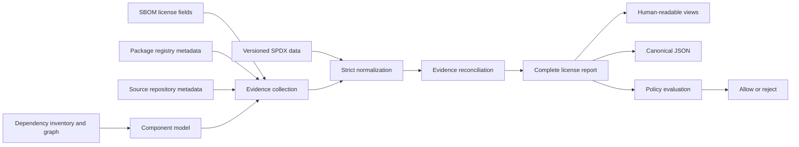

# Ol Design

## Purpose

Ol is a license-compliance tool for understanding which OSS libraries an application uses, including transitive dependencies, and whether their licenses are acceptable to the user.

Its job is broader than parsing an SBOM. An SBOM is the initial dependency inventory and graph input, while SPDX data, package registries, and source repositories supply additional license evidence. Ol combines those sources into an explainable result that a person can review and that a later policy check can evaluate in CI.

Ol does not provide legal advice or claim legal certainty. It preserves uncertainty, disagreement, and collection failures instead of guessing.

## Design Goals

1. **Resolve the complete dependency inventory.** Preserve root, direct, transitive, and unknown relationships so indirect OSS use remains visible.
2. **Build license conclusions from evidence.** Treat SBOM fields, package metadata, and source repositories as independently attributable evidence sources.
3. **Remain explainable.** Retain raw values, normalized candidates, provenance, warnings, and conflicts behind every component result.
4. **Normalize strictly and reproducibly.** Validate against an explicit, versioned SPDX License List and emit official SPDX casing without loose alias guessing.
5. **Separate observation from policy.** First produce a complete license report; policy enforcement consumes that report and decides what is forbidden.
6. **Support people and automation.** Keep text and Markdown easy to review, and make JSON the stable machine-readable contract.
7. **Continue when individual evidence sources fail.** A failure for one component or source must not discard usable evidence for other components.
8. **Protect local and authentication data.** Never expose tokens, absolute private paths, or hidden cache locations in reports.
9. **Stay suitable for a small native CLI.** Keep the runtime independent of development-time generators and compatible with Native AOT.

## Non-Goals

- Inferring legal compatibility or obligations beyond configured policy.
- Guessing a precise SPDX identifier from vague natural-language license text.
- Treating any single evidence source as universally authoritative.
- Hiding unknown, ambiguous, invalid, conflicting, deprecated, or unavailable evidence.
- Performing policy enforcement inside evidence collection and reconciliation.

## Design Decisions and Rationale

The specifications define observable behavior. The following decisions explain why those behaviors fit together as one system rather than as independent command features.

| Design decision | Why Ol needs it | Consequences for specifications |
|---|---|---|
| Resolve the complete dependency inventory before filtering. | The licenses of transitive dependencies matter even when a user initially asks to view only direct dependencies. Early filtering could erase graph context and incorrectly classify or hide OSS use. | [Dependency type](specs/cli.md#contract-dependency-type) remains explicit, and [dependency filtering](specs/cli.md#contract-dependency-filtering) is a view over the complete analysis. |
| Preserve evidence instead of selecting a single authoritative source. | SBOMs, registries, and repositories can each be absent, stale, inferred, or wrong. Disagreement is itself compliance-relevant information. | The shared [component statuses](specs/cli.md#contract-component-status), [SPDX candidate records](specs/spdx.md#contract-candidate-evidence), [package evidence](specs/packagemanager.md#contract-package-evidence), and [source evidence](specs/source.md#contract-source-evidence) preserve agreement, uncertainty, and conflict. |
| Normalize only against versioned SPDX data. | Reproducible policy decisions require stable identifiers and semantics. Guessing aliases would turn uncertain evidence into false certainty, while using an implicit live list would make identical inputs change over time. | [SPDX identifiers and expressions](specs/spdx.md#contract-spdx-normalization) use official data and casing, while [strict normalization](specs/spdx.md#contract-strict-normalization) preserves ambiguity. |
| Prefer explicit SPDX selection while retaining an offline fallback. | Users need to reproduce a specific environment or test new SPDX data, but ordinary scans must not require network availability or prior setup. | [SPDX data resolution](specs/spdx.md#contract-spdx-data-resolution) prioritizes an explicit source, then user-managed data, then the bundled snapshot; [SPDX commands](specs/spdx.md#contract-spdx-commands) manage the user-selected version. |
| Separate factual resolution from organizational policy. | Whether a valid license is permitted depends on the user's organization and context, not on evidence collection. The same facts may be evaluated under different policies. | `matched` means resolved, not allowed; [future policy checks](specs/cli.md#contract-policy-checks) consume scan evidence and can reject forbidden or unresolved results without rescanning. |
| Make component/source failures best-effort but command failures explicit. | One unavailable registry or repository must not hide all other OSS dependencies, but a report cannot be trusted when the inventory or output itself cannot be produced. | [Scan failure behavior](specs/cli.md#contract-scan-failures), [package best-effort execution](specs/packagemanager.md#contract-package-best-effort), and [source best-effort execution](specs/source.md#contract-source-best-effort) distinguish recoverable evidence failures from unusable commands. |
| Use canonical JSON plus human-oriented projections. | CI and policy engines need stable structured evidence, while reviewers need compact, readable output. A single canonical model prevents the two views from reaching different conclusions. | [Output formats](specs/cli.md#contract-output-formats) are projections of the same result, while the [JSON report](specs/cli.md#contract-json-report) retains complete machine-readable evidence. |
| Make evidence freshness explicit rather than time-dependent. | An implicit TTL makes identical inputs produce different network and evidence behavior depending on wall-clock time. Users need deliberate control over reproducibility versus refresh. | [Package caches](specs/packagemanager.md#contract-package-cache) and [source caches](specs/source.md#contract-source-cache) persist until explicitly refreshed or cleared. |
| Version the persistent evidence format. | Cache entries survive process and Ol version boundaries. Without an explicit schema, an upgrade could silently reinterpret stale data and produce an incorrect license conclusion. | The [compatibility contract](specs/cache_format.md#compatibility-contract), [package schema](specs/cache_format.md#contract-package-cache-v1), and [source schema](specs/cache_format.md#contract-source-cache-v1) define validation and evolution independently of serializer implementation. |
| Bound external I/O and retry only plausibly transient failures. | License resolution must remain responsive and respectful of shared services; retrying permanent failures wastes time and rate limits without improving evidence. | [Package concurrency](specs/packagemanager.md#contract-package-concurrency), [package retries](specs/packagemanager.md#contract-package-retries), and the [source request strategy](specs/source.md#contract-source-request-strategy) bound work and avoid unnecessary requests. |
| Persist evidence with explicit provenance and privacy boundaries. | Repeated network access is slow and unreliable, while package names, private repositories, local paths, and tokens can be sensitive. | [Report privacy](specs/cli.md#contract-report-privacy), [package-cache privacy](specs/packagemanager.md#contract-package-privacy), and [source authentication](specs/source.md#contract-source-authentication) retain auditability without exposing secrets or private paths. |
| Make credential use explicit and confine it to its intended authority. | Implicitly discovering credentials or forwarding them across hosts can leak secrets and makes execution difficult to audit. | [Source authentication](specs/source.md#contract-source-authentication) accepts only the Ol-specific token input, sends it only to the GitHub API boundary, and reports authentication mode rather than values. |
| Add evidence sources through one reconciliation model. | Source-specific final-result logic would make status semantics depend on which integration happened to run and would become impossible to reason about as sources grow. | [Package evidence](specs/packagemanager.md#contract-package-evidence) and [source evidence](specs/source.md#contract-source-evidence) become common candidates governed by the same statuses and SPDX semantics. |

These decisions are normative design constraints. A feature specification may specialize them, but should link to the relevant decision and state any intentional exception.

## System Model

Ol is designed as the following target pipeline. Inventory, SBOM evidence, SPDX normalization, package metadata, source-repository evidence, reconciliation, and reporting are implemented; policy evaluation remains a planned stage.

The stages have distinct responsibilities:

1. **Inventory and graph ingestion** uses one registered input adapter to discover components, occurrences, resolution contexts, and dependency edges. CycloneDX JSON, SPDX JSON and package manager's dependency graph are the supported formats.
2. **Evidence collection** adds raw license claims and collection outcomes from all available sources.
3. **SPDX normalization** validates identifiers and expressions against the selected License List snapshot.
4. **Reconciliation** reduces all candidates for one component to a status without discarding provenance.
5. **Reporting** exposes components, relationships, evidence, metadata, warnings, and summaries.
6. **Policy evaluation** is a downstream phase that rejects forbidden licenses or unresolved risk according to explicit user policy.

This ordering is intentional. Dependency filtering and policy checks must not reduce the input before the complete graph and evidence set have been resolved.

## Core Domain Model

### Component identity

A component represents one OSS package occurrence known from the dependency inventory. Its stable descriptive fields include:

- source identifier (`bom-ref` or SPDX ID when available)
- package name and version
- package URL (purl) and inferred ecosystem
- dependency relationship: `root`, `direct`, `transitive`, or `unknown`

The purl, when versioned and supported, is the preferred identity for registry lookups and cache keys. Missing graph information is represented as `unknown`; it is never interpreted as proof that a component is not direct or transitive.

The normalized inventory keeps component data separate from graph placement:

- a component contains package identity and input-provided license evidence;
- an occurrence points to one component and one resolution context;
- an edge points between occurrence indexes within one context; and
- an absent context is represented explicitly rather than inferred from the host running Ol.

SBOM inputs currently provide no common platform-resolution context, so their occurrences use the unspecified-context sentinel. Their resolved edges are retained when both endpoint identifiers map to parsed components. View sorting and filtering operate on a projection and must not reorder the inventory arrays referenced by occurrences and edges.

NuGet assets inputs preserve every target framework/RID graph as a separate context. The RID is retained without inferring platform or architecture. A context-root edge sentinel anchors proven direct package edges; project references participate in reachability classification but are not represented as NuGet packages. Repeated package/version values remain separate occurrences, while their versioned purl provides the shared enrichment identity.

Canonical JSON writes the complete input-order inventory separately from sorted, filtered, or grouped report components. A context-owned project root uses an edge endpoint sentinel instead of allocating or rendering a non-package license component. Human-readable reports identify the registered input kind and format before their table.

### License candidate

A license candidate is one source's claim about a component. It retains:

- evidence source and kind
- raw value
- normalized SPDX expression when valid
- classification status
- deprecation flag and warnings

Candidates are append-only inputs to reconciliation. Enrichment adds evidence rather than overwriting the original SBOM claim.

### License evidence provenance

Evidence provenance explains why a candidate exists and how that claim can be traced back to its source. It is not a second copy of the candidate. Canonical JSON therefore attaches one typed `evidence` object to each `licenseCandidates` item and does not expose a duplicate component-level candidate array.

For audit purposes, evidence is a traceable observation: it must identify the input field or collected record that produced the candidate closely enough for a reviewer to locate and re-check it. Evidence establishes provenance, not legal truth. The candidate contains the observed claim and its interpretation; evidence contains only the additional coordinates, identity, time, and collection result needed to audit that claim.

The initial provenance families are SBOM fields, package registry collection records, and source repository inspection records. Each family exposes only details that add audit value beyond the common candidate fields: the exact SBOM field and explicit acknowledgement, an opaque registry cache identity and collection time, or repository/ref/response/license-file metadata.

A declared or concluded value is an assertion, not proof that the assertion was independently verified. Likewise, the presence of a BOM signature or a CycloneDX declaration attestation does not by itself attest a particular license candidate. Ol must only report candidate attestation after it can preserve the explicit candidate-to-claim mapping and the verification result; it must never infer `attested` from nearby document metadata.

### Component license result

Reconciliation produces one of these statuses:

- `matched`: all usable valid evidence collapses to one SPDX expression
- `conflict`: usable valid evidence contains different expressions
- `unknown`: sources were checked but supplied no usable license
- `ambiguous`: text exists but strict normalization would require guessing
- `invalid`: a claimed SPDX expression is syntactically invalid or uses unknown identifiers
- `error`: required evidence could not be collected or processed and no usable candidate remains

A source failure does not override a valid candidate. For example, a registry failure remains warning evidence when an SBOM candidate already establishes a single valid expression.

### Policy result

Policy is deliberately not encoded in `matched`. A valid, unambiguous SPDX expression can still be forbidden by an organization's rules. Future policy evaluation consumes the completed report and fails closed for configured deny-list or allow-list misses and, by default, unresolved states such as `unknown`, `conflict`, `ambiguous`, `invalid`, and `error`.

Keeping policy separate allows the same factual report to be evaluated under different organizational policies without rescanning dependencies or recollecting evidence.

## Evidence Architecture

### SBOM evidence

CycloneDX and SPDX JSON provide the initial component inventory, dependency graph, and license fields through registered dependency-input handlers. Each handler owns its marker, public format identity, parser, and input metadata projection. Input format is detected from content. A document containing markers for both formats is rejected as ambiguous.

The scanner resolves the full graph before any output filter is applied. SPDX `licenseDeclared` and `licenseConcluded` are separate candidates. Multiple CycloneDX license IDs without explicit `AND` or `OR` semantics remain ambiguous.

### Package metadata evidence

Versioned purls plan lookups for supported package ecosystems. Registry clients normalize transport-specific responses into a common metadata record, after which license values pass through the same SPDX candidate factory and reconciler as SBOM evidence.

The initial ecosystems are npm, NuGet, Cargo, and Go modules. Unsupported ecosystems and successful responses without license text produce explicit non-fatal evidence. Fetches are concurrent, bounded, retry only transient failures, and are cached by the package schema's canonical identity.

### Source repository evidence (implemented v3)

Source evidence extends the same model rather than creating a separate result path. Repository identities come from existing SBOM or package metadata evidence. The initial GitHub integration uses the GitHub License API and does not attempt to outguess an unidentified license by parsing arbitrary license-file text.

Only `OL_GITHUB_TOKEN` is an authentication input. Authentication is restricted to the intended GitHub API host, and reports retain only the authentication mode.

### Adding an evidence source

A new evidence source should provide four narrow capabilities:

1. plan a target from existing component identity or evidence
2. fetch or read source-specific data at an I/O boundary
3. normalize the response into common candidates, warnings, and errors
4. pass those candidates through the shared SPDX validation and reconciliation path

It must not introduce source-specific final statuses or bypass the common result model.

## SPDX Data Design

SPDX data is versioned domain data, not an implicit network dependency. Runtime resolution order is:

1. an explicit CLI data directory
2. the active user-managed SPDX version
3. data bundled into the CLI

The chosen source, License List version, logical reference, and hashes are report metadata. Identifier matching is case-insensitive, while normalized output uses official casing. Natural-language aliases are not guessed.

`Ol.Update` is a development-time generator that refreshes bundled SPDX lookup data. The runtime CLI depends on the generated data through `Ol.Core`; it does not depend on the generator or the network to perform ordinary validation.

## Component Boundaries

### `Ol.Core`

`Ol.Core` owns deterministic domain behavior and reusable infrastructure:

- dependency inventory scanning and relationship resolution
- immutable dependency-input registration and normalized inventory projection
- SPDX identifier and expression validation
- candidate creation and license reconciliation
- package metadata request planning, registry access, retry scheduling, and cache records
- user-managed SPDX storage
- component, evidence, and report models

Pure transformations should remain separate from filesystem, clock, environment, and network boundaries where practical.

### `Ol`

The `Ol` executable is the application boundary. It owns:

- command-line parsing and validation
- choosing active SPDX data
- orchestrating scan and enrichment phases
- concurrency and runtime option selection
- filtering, sorting, grouping, and rendering
- stdout, stderr, output files, and process exit behavior
- environment-derived cache roots and authentication configuration

Output filtering is a view concern. It must not alter dependency resolution or evidence reconciliation.

### `Ol.Update`

`Ol.Update` downloads upstream SPDX License List data during development and emits deterministic bundled lookup source. Generated output is committed or otherwise supplied to `Ol.Core` at build time, keeping runtime deployment small and reproducible.

## Failure Model

Ol distinguishes failures by scope:

- **Whole-command failures** prevent a trustworthy report, such as unreadable input, unsupported or unusable inventory format, unavailable SPDX data, or unwritable output.
- **Component/source failures** become evidence and warnings, allowing other components and sources to complete.
- **Policy failures** occur only after a complete report exists and mean the observed result violates configured policy.

This distinction prevents a transient registry problem from being confused with a forbidden license and prevents a single package from hiding the rest of the dependency inventory.

## Caching and Network Design

Evidence caches are persistent and keyed by a category-defined canonical identity. Their physical representation is opaque so package or private repository names are not exposed by directory listings, while logical provenance remains available for auditability.

The persistent JSON schema is versioned separately from report JSON. Cache compatibility is an upgrade contract: unsupported or malformed entries are migrated or recollected, never silently reinterpreted. Exact entry fields and category-specific schemas are defined by the [evidence cache format specification](specs/cache_format.md).

There is no implicit TTL. `--refresh` makes freshness an explicit user decision rather than a wall-clock side effect. Cache failures should remain component-scoped whenever a trustworthy report can still be produced.

External I/O is bounded so dependency count cannot create uncontrolled pressure on the process or shared services. Output ordering remains deterministic regardless of request completion order. Retry policy applies only when another attempt can plausibly succeed, such as timeouts, rate limits, server failures, and transient transport errors.

## Report and View Design

JSON is the canonical report because policy engines and CI require structured candidates, evidence, metadata, warnings, and summaries. Text and Markdown are projections optimized for review.

The report preserves:

- tool and input metadata
- active SPDX data identity and hashes
- network/cache metadata
- complete component identities and dependency relationships
- raw and normalized license candidates
- reconciled status, warnings, and evidence
- summary counts

Reports use logical references or safe relative names. They do not include tokens, absolute local paths, or hidden cache paths.

Sorting, grouping, and dependency filtering operate after complete analysis. If filtering excludes components with an unknown relationship, the summary makes that uncertainty visible.

## Performance Model

Performance work follows pipeline boundaries rather than focusing only on SBOM parsing:

- inventory ingestion and dependency graph resolution scale with input size without unnecessary duplication
- SPDX normalization and reconciliation avoid repeating equivalent work for each candidate
- registry and planned source enrichment keep external work bounded and reusable
- reporting derives all views from the resolved model rather than repeating analysis
- policy evaluation operates on the existing report without recollecting evidence

Optimizations require representative benchmarks for the affected stage. Performance techniques belong in implementation guidance; this design requires predictable resource use without changing evidence or policy semantics.

## Evolution Rules

1. Earlier report fields remain stable unless a breaking version explicitly changes them.
2. New evidence sources enrich the common candidate model and reconciliation rules.
3. New inventory formats map into the same component and dependency relationship model.
4. New policy behavior consumes reports; it does not become an implicit scanner side effect.
5. Source-specific transport details stay behind narrow I/O boundaries.
6. Observable uncertainty is preserved rather than resolved by heuristics.
7. Specifications define user-visible behavior; this document records the system design that realizes those specifications.

## Current and Planned Scope

- **v1 — implemented:** CycloneDX/SPDX JSON inventory, dependency relationships, SPDX validation, and reports.
- **v2 — implemented:** package-registry evidence, persistent metadata cache, bounded external-request concurrency, and retries.
- **v3 — implemented:** source-repository evidence through the GitHub License API, typed candidate provenance, and source evidence caching.
- **Later policy phase — planned:** explicit allow-list/deny-list evaluation and CI failure behavior over the canonical report.

The architectural destination is therefore a transitive OSS license resolver and policy input, not an SBOM viewer. SBOM support is one ingestion mechanism for constructing the dependency and evidence model.

## Related Specifications

- [CLI behavior and report contract](specs/cli.md)
- [SPDX data and license semantics](specs/spdx.md)
- [Package metadata evidence](specs/packagemanager.md)
- [Source repository evidence](specs/source.md)
- [Persistent evidence cache format](specs/cache_format.md)
- [Stability and public output verification](specs/verification.md)
