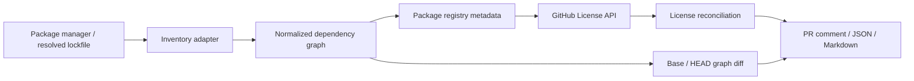

# Package Manager Input Plan

## Background

`ol` currently accepts CycloneDX JSON and SPDX JSON SBOMs, normalizes their dependency and license evidence into `ScanComponent`, enriches components from package registries and GitHub's License API, then renders a report.

Feedback requests a PR-oriented workflow that works without an SBOM:

> When a pull request adds a library, show the direct and transitive packages newly required by the change, along with each license.

The desired feature is not an SBOM replacement. SBOM remains a useful standardized input for artifact exchange and audits. Instead, `ol` should support multiple dependency-inventory inputs, including a package manager's resolved dependency graph.

## Conclusion

Cross-language support without an SBOM is feasible if `ol` consumes **resolved dependency inventories** from package managers or their lockfiles and normalizes them to the existing component model.

Package registry APIs and repository License APIs are evidence-enrichment sources only. They cannot determine which transitive dependencies a project actually resolved. The dependency inventory must therefore come first.



## Existing Reusable Pipeline

The current implementation already separates inventory ingestion from most license resolution work:

1. `SbomScanner` reads CycloneDX or SPDX JSON and produces `ScanReport` with `ScanComponent[]`.
2. `PackageMetadataService` accepts `ScanComponent[]`, deduplicates supported versioned purls, and looks up package metadata.
3. `SourceRepositoryService` accepts `ScanComponent[]`, resolves GitHub repositories, and calls the GitHub License API.
4. `LicenseReconciler` appends and reconciles all license candidates.
5. View/filter/group/render logic consumes normalized components.

An inventory adapter can construct `ScanComponent` directly and pass the result through the current enrichment pipeline. For a source that supplies no native license declaration, components should start without a primary candidate; package-registry and source-repository candidates then provide the normal evidence trail.

The primary compatibility boundary is a valid, versioned package URL (purl). The current package-metadata providers support:

- npm: `pkg:npm/...`
- NuGet: `pkg:nuget/...`
- Cargo: `pkg:cargo/...`
- Go: `pkg:golang/...`

GitHub source enrichment is intentionally limited to repositories that normalize to GitHub URLs.

## Do Not Reimplement Dependency Resolution

Do not read only manifests such as `package.json`, `Cargo.toml`, or project files and then recursively resolve dependencies through registry APIs. That would require `ol` to duplicate each ecosystem's version-selection, target-platform, optional-dependency, and peer-dependency semantics.

Use the package manager's already resolved result instead. This is necessary to accurately answer what is newly required by a PR.

| Ecosystem | Preferred resolved input | Notes |
|---|---|---|
| NuGet / .NET | `obj/project.assets.json` | Contains restore results and target-specific dependency graphs. |
| npm | `package-lock.json` | Provides the resolved install tree. |
| pnpm | `pnpm-lock.yaml` | Requires traversing importers and package snapshots. |
| Cargo | `Cargo.lock` plus `Cargo.toml` | Lockfile provides resolution; manifest helps identify direct dependencies. |
| Go | `go list -m -json all` and/or `go mod graph` | Do not treat `go.sum` alone as a dependency graph. |
| Maven / Gradle | Package manager dependency report | Prefer tool output over independently emulating Gradle/Maven resolution. |
| Python | Tool-specific resolved lockfile | Add adapters per supported tool, for example uv or Poetry. |

## Proposed Command Model

Keep `scan` for SBOM inputs and introduce inventory-specific commands rather than pretending all inputs are SBOMs.

```text
ol inventory --ecosystem nuget --input obj/project.assets.json --format json --out head.inventory.json
ol diff --before base.inventory.json --after head.inventory.json --format markdown
```

Responsibilities:

- `inventory`: parse one resolved package-manager input, normalize the dependency graph, enrich license evidence, and render/store a portable inventory result.
- `diff`: compare two normalized inventories and report dependency changes, including reconciled license evidence.
- CI: prepares base and head worktrees/checkouts, runs restore/install, and passes their generated inventories to `ol`. `ol` should not initially own Git checkout or restore/install orchestration.

Potential future convenience command:

```text
ol inventory diff --before <resolved-input> --after <resolved-input> ...
```

This should only be added after the standalone inventory format and diff contract are stable.

## Normalized Inventory Requirements

The SBOM-specific `ScanReport` metadata currently contains format, spec version, source path, and SBOM hashes. An inventory input must instead record explicit inventory metadata rather than a synthetic SBOM format.

Required normalized fields per occurrence:

- ecosystem
- normalized package name
- resolved version
- versioned purl, when representable
- direct, transitive, root, or unknown dependency type
- dependency edges
- project/workspace origin
- target framework, platform, or resolver target where relevant
- source input and parser/resolver identity
- package-manager native repository or license data, if supplied

A package identity is not enough for graph reporting. The same package/version may occur through different roots, target frameworks, platforms, or dependency paths. Preserve occurrences and graph edges in the inventory; deduplicate only network metadata requests by normalized versioned purl.

When an input cannot prove a dependency relation, report `unknown` rather than classifying it as direct or transitive.

## PR Diff Semantics

Generate resolved inventories from the base commit and PR head, then compare them.

A package occurrence should retain a logical identity such as:

$$
(\text{ecosystem},\ \text{normalized package name},\ \text{resolved version},\ \text{origin/target})
$$

Classify results as:

- `added`: a resolved dependency occurrence exists only in head.
- `removed`: a resolved dependency occurrence exists only in base.
- `updated`: the same logical dependency changed resolved version.
- `dependency-path-changed`: version remains the same but the origin or dependency path changed.

PR comments should normally focus on `added` and `updated` items, with warnings prominently surfaced for `unknown`, `conflict`, `invalid`, or fetch-error license outcomes.

Example report shape:

| Change | Package | Dependency | License | Evidence |
|---|---|---|---|---|
| added | Foo.Bar 2.1.0 | direct | MIT | NuGet registry |
| added | Baz.Core 4.0.2 | transitive | Apache-2.0 | GitHub License API |
| updated | Qux 1.3.0 → 1.4.0 | transitive | MIT → BSD-3-Clause | registry |

## Recommended Delivery Order

### Phase 1: NuGet resolved inventory

Start with NuGet because this repository is .NET-based and `project.assets.json` provides a strong resolved graph source.

Scope:

- Read a restore-complete `project.assets.json`.
- Create `pkg:nuget/{id}@{version}` purls.
- Capture target framework/RID and project origin.
- Identify direct and transitive dependencies from the asset graph.
- Reuse package-metadata, cache, source-repository, reconciliation, and rendering services.
- Explicitly define treatment of project references, local/path dependencies, unresolved entries, and multiple target graphs.

Initial constraints should be conservative:

- Preserve target-specific occurrences instead of silently merging divergent graphs.
- Classify any relation not proven by the asset graph as `unknown`.
- Treat unsupported package forms as retained inventory entries with explicit warnings, not as silently omitted components.

### Phase 2: Portable inventory output and `diff`

Define a stable inventory JSON representation that includes input metadata, package occurrences, graph edges, and license evidence. Implement `diff` against that format so base/head generation can be external to the tool.

### Phase 3: CI integration

In a PR workflow:

1. Check out base and head revisions in isolated worktrees/directories.
2. Run the relevant restore/install command in each.
3. Produce normalized inventories.
4. Run `ol diff`.
5. Publish Markdown as a PR comment or check summary.

### Phase 4: Additional ecosystem adapters

Add npm, Cargo, and Go adapters one at a time. Each adapter is responsible only for converting that ecosystem's resolved input into the common inventory graph. It must not duplicate license reconciliation, cache, enrichment, rendering, or diff logic.

## Design Risks and Decisions Needed

### Input/report model coupling

`ScanReport` and JSON rendering are SBOM-shaped today. Introduce an input descriptor or inventory report model that accurately identifies input kind, parser, source, and resolution target. Do not label a lockfile as an SBOM.

### Graph fidelity

Lockfiles and package-manager outputs differ materially. They may flatten dependencies, omit roots, represent multiple target graphs, or preserve only selected paths. Each adapter requires documented classification rules and fixtures for ambiguous cases.

### Purl correctness

Purl generation controls registry support, caching, and metadata deduplication. Namespace handling, npm scopes, NuGet normalization, Go module paths, prereleases, git dependencies, workspace dependencies, qualifiers, and subpaths require explicit rules and negative tests.

### Provenance

Current license evidence distinguishes SBOM, package registry, and source repository. An inventory parser that provides its own license/repository claim needs an inventory-origin provenance representation rather than fabricated SBOM evidence.

### Source coverage

GitHub License API enrichment only works for GitHub repositories. A valid non-GitHub package source remains unsupported at that evidence tier unless additional source providers are introduced later.

### Network behavior

An SBOM-less inventory may cause immediate registry lookup for every package on its first run. Existing persistent caches, bounded concurrency, retry handling, `--refresh`, and `--skip-enrichment` mitigate this, but CI policy should define cache sharing and acceptable first-run latency.

### Test strategy

Current ecosystem validation is SBOM-centric. Add independent fixture contracts for each package-manager input, including:

- resolved package identities and purls
- direct/transitive/unknown classification
- target/framework variations
- duplicate package occurrences
- unsupported and malformed input
- no-network enrichment behavior
- registry/source evidence reconciliation
- base/head diff classification

## Success Criteria

The feature is ready for general use when a PR workflow can, without generating an SBOM:

1. Obtain each revision's package manager-resolved dependency graph.
2. Identify packages newly introduced or version-updated by the PR, including transitives.
3. Report direct/transitive status only when supported by source evidence.
4. Resolve licenses using the existing package-registry and GitHub source evidence pipeline.
5. Preserve warnings, conflicts, unknowns, and evidence provenance in JSON and Markdown output.
6. Produce deterministic, target-aware results across supported ecosystems.
