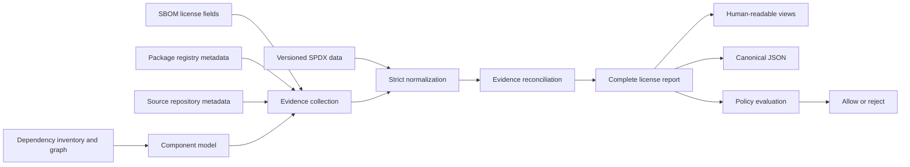

# Ol Design

## Purpose

Ol is a license-compliance tool for understanding which OSS libraries an application uses, including transitive dependencies, and whether their licenses are acceptable to the user.

Its job is broader than parsing an SBOM. An SBOM is the initial dependency inventory and graph input, while SPDX data, package registries, and source repositories supply additional license evidence. Ol combines those sources into an explainable result that a person can review and that a later policy check can evaluate in CI.

Ol does not provide legal advice or claim legal certainty. It preserves uncertainty, disagreement, and collection failures instead of guessing.

## Design Goals

1. **Resolve the complete dependency inventory.** Preserve root, direct, transitive, and unknown relationships so indirect OSS use remains visible.
2. **Build license conclusions from evidence.** Treat SBOM fields, package metadata, and source repositories as independently attributable evidence sources.
3. **Remain explainable.** Retain raw values, normalized candidates, provenance, warnings, and conflicts behind every component result.
4. **Normalize strictly and reproducibly.** Validate against an explicit, versioned SPDX License List and emit official SPDX casing without loose alias guessing.
5. **Separate observation from policy.** First produce a complete license report; policy enforcement consumes that report and decides what is forbidden.
6. **Support people and automation.** Keep text and Markdown easy to review, and make JSON the stable machine-readable contract.
7. **Continue when individual evidence sources fail.** A failure for one component or source must not discard usable evidence for other components.
8. **Protect local and authentication data.** Never expose tokens, absolute private paths, or hidden cache locations in reports.
9. **Stay suitable for a small native CLI.** Keep the runtime independent of development-time generators and compatible with Native AOT.

## Non-Goals

- Inferring legal compatibility or obligations beyond configured policy.
- Guessing a precise SPDX identifier from vague natural-language license text.
- Treating any single evidence source as universally authoritative.
- Hiding unknown, ambiguous, invalid, conflicting, deprecated, or unavailable evidence.
- Performing policy enforcement inside evidence collection and reconciliation.

## System Model

Ol is designed as a staged pipeline:

The stages have distinct responsibilities:

1. **Inventory and graph ingestion** discovers components and their dependency relationships. CycloneDX JSON and SPDX JSON are the initial supported inputs.
2. **Evidence collection** adds raw license claims and collection outcomes from all available sources.
3. **SPDX normalization** validates identifiers and expressions against the selected License List snapshot.
4. **Reconciliation** reduces all candidates for one component to a status without discarding provenance.
5. **Reporting** exposes components, relationships, evidence, metadata, warnings, and summaries.
6. **Policy evaluation** is a downstream phase that rejects forbidden licenses or unresolved risk according to explicit user policy.

This ordering is intentional. Dependency filtering and policy checks must not reduce the input before the complete graph and evidence set have been resolved.

## Core Domain Model

### Component identity

A component represents one OSS package occurrence known from the dependency inventory. Its stable descriptive fields include:

- source identifier (`bom-ref` or SPDX ID when available)
- package name and version
- package URL (purl) and inferred ecosystem
- dependency relationship: `root`, `direct`, `transitive`, or `unknown`

The purl, when versioned and supported, is the preferred identity for registry lookups and cache keys. Missing graph information is represented as `unknown`; it is never interpreted as proof that a component is not direct or transitive.

### License candidate

A license candidate is one source's claim about a component. It retains:

- evidence source and kind
- raw value
- normalized SPDX expression when valid
- classification status
- deprecation flag and warnings

Candidates are append-only inputs to reconciliation. Enrichment adds evidence rather than overwriting the original SBOM claim.

### Component license result

Reconciliation produces one of these statuses:

- `matched`: all usable valid evidence collapses to one SPDX expression
- `conflict`: usable valid evidence contains different expressions
- `unknown`: sources were checked but supplied no usable license
- `ambiguous`: text exists but strict normalization would require guessing
- `invalid`: a claimed SPDX expression is syntactically invalid or uses unknown identifiers
- `error`: required evidence could not be collected or processed and no usable candidate remains

A source failure does not override a valid candidate. For example, a registry failure remains warning evidence when an SBOM candidate already establishes a single valid expression.

### Policy result

Policy is deliberately not encoded in `matched`. A valid, unambiguous SPDX expression can still be forbidden by an organization's rules. Future policy evaluation consumes the completed report and fails closed for configured deny-list or allow-list misses and, by default, unresolved states such as `unknown`, `conflict`, `ambiguous`, `invalid`, and `error`.

Keeping policy separate allows the same factual report to be evaluated under different organizational policies without rescanning dependencies or recollecting evidence.

## Evidence Architecture

### SBOM evidence

CycloneDX and SPDX JSON provide the initial component inventory, dependency graph, and license fields. Input format is detected from content. A document containing markers for both formats is rejected as ambiguous.

The scanner resolves the full graph before any output filter is applied. SPDX `licenseDeclared` and `licenseConcluded` are separate candidates. Multiple CycloneDX license IDs without explicit `AND` or `OR` semantics remain ambiguous.

### Package metadata evidence

Versioned purls plan lookups for supported package ecosystems. Registry clients normalize transport-specific responses into a common metadata record, after which license values pass through the same SPDX candidate factory and reconciler as SBOM evidence.

The initial ecosystems are npm, NuGet, Cargo, and Go modules. Unsupported ecosystems and successful responses without license text produce explicit non-fatal evidence. Fetches are concurrent, bounded, retry only transient failures, and are cached by normalized package identity.

### Source repository evidence

Source evidence extends the same model rather than creating a separate result path. Repository identities come from existing SBOM or package metadata evidence. The initial GitHub integration uses the GitHub License API and does not attempt to outguess an unidentified license by parsing arbitrary license-file text.

Only `OL_GITHUB_TOKEN` is an authentication input. Authentication is restricted to the intended GitHub API host, and reports retain only the authentication mode.

### Adding an evidence source

A new evidence source should provide four narrow capabilities:

1. plan a target from existing component identity or evidence
2. fetch or read source-specific data at an I/O boundary
3. normalize the response into common candidates, warnings, and errors
4. pass those candidates through the shared SPDX validation and reconciliation path

It must not introduce source-specific final statuses or bypass the common result model.

## SPDX Data Design

SPDX data is versioned domain data, not an implicit network dependency. Runtime resolution order is:

1. an explicit CLI data directory
2. the active user-managed SPDX version
3. data bundled into the CLI

The chosen source, License List version, logical reference, and hashes are report metadata. Identifier matching is case-insensitive, while normalized output uses official casing. Natural-language aliases are not guessed.

`Ol.Update` is a development-time generator that refreshes bundled SPDX lookup data. The runtime CLI depends on the generated data through `Ol.Core`; it does not depend on the generator or the network to perform ordinary validation.

## Component Boundaries

### `Ol.Core`

`Ol.Core` owns deterministic domain behavior and reusable infrastructure:

- dependency inventory scanning and relationship resolution
- SPDX identifier and expression validation
- candidate creation and license reconciliation
- package metadata request planning, registry access, retry scheduling, and cache records
- user-managed SPDX storage
- source-backed UTF-8 domain values and report models

Pure transformations should remain separate from filesystem, clock, environment, and network boundaries where practical.

### `Ol`

The `Ol` executable is the application boundary. It owns:

- command-line parsing and validation
- choosing active SPDX data
- orchestrating scan and enrichment phases
- concurrency and runtime option selection
- filtering, sorting, grouping, and rendering
- stdout, stderr, output files, and process exit behavior
- environment-derived cache roots and authentication configuration

Output filtering is a view concern. It must not alter dependency resolution or evidence reconciliation.

### `Ol.Update`

`Ol.Update` downloads upstream SPDX License List data during development and emits deterministic bundled lookup source. Generated output is committed or otherwise supplied to `Ol.Core` at build time, keeping runtime deployment small and reproducible.

## Failure Model

Ol distinguishes failures by scope:

- **Whole-command failures** prevent a trustworthy report, such as unreadable input, unsupported or unusable inventory format, unavailable SPDX data, or unwritable output.
- **Component/source failures** become evidence and warnings, allowing other components and sources to complete.
- **Policy failures** occur only after a complete report exists and mean the observed result violates configured policy.

This distinction prevents a transient registry problem from being confused with a forbidden license and prevents a single package from hiding the rest of the dependency inventory.

## Caching and Network Design

Evidence caches are persistent and keyed by normalized logical identity. File names use SHA-256 hashes so package or private repository names are not exposed by directory listings. Cache bodies retain the logical key and schema version for auditability.

There is no implicit TTL. `--refresh` bypasses existing entries and replaces successful results. Corrupt or failed entries are component-scoped problems and should not terminate the full analysis.

Concurrency is bounded and output ordering is deterministic regardless of request completion order. Retry policy applies only to transient failures such as timeouts, HTTP 429, HTTP 5xx, and transient transport errors.

## Report and View Design

JSON is the canonical report because policy engines and CI require structured candidates, evidence, metadata, warnings, and summaries. Text and Markdown are projections optimized for review.

The report preserves:

- tool and input metadata
- active SPDX data identity and hashes
- network/cache metadata
- complete component identities and dependency relationships
- raw and normalized license candidates
- reconciled status, warnings, and evidence
- summary counts

Reports use logical references or safe relative names. They do not include tokens, absolute local paths, or hidden cache paths.

Sorting, grouping, and dependency filtering operate after complete analysis. If filtering excludes components with an unknown relationship, the summary makes that uncertainty visible.

## Performance Model

Performance work follows pipeline boundaries rather than focusing only on SBOM parsing:

- inventory ingestion avoids copying source-backed UTF-8 text
- dependency graph resolution uses bounded temporary storage
- SPDX lookup and expression normalization avoid repeated decoding and lookup
- reconciliation avoids avoidable per-candidate allocations
- registry and source enrichment bound concurrency and deduplicate cache/network work
- rendering allocates owned output intentionally but avoids repeated domain conversion
- policy evaluation should operate on the existing report without recollecting evidence

Optimizations require representative benchmarks for the affected stage. Required result ownership is not treated as an allocation defect; transient allocations inside repeated component and candidate loops are.

## Evolution Rules

1. Earlier report fields remain stable unless a breaking version explicitly changes them.
2. New evidence sources enrich the common candidate model and reconciliation rules.
3. New inventory formats map into the same component and dependency relationship model.
4. New policy behavior consumes reports; it does not become an implicit scanner side effect.
5. Source-specific transport details stay behind narrow I/O boundaries.
6. Observable uncertainty is preserved rather than resolved by heuristics.
7. Specifications define user-visible behavior; this document records the system design that realizes those specifications.

## Current and Planned Scope

- **v1:** CycloneDX/SPDX JSON inventory, dependency relationships, SPDX validation, and reports.
- **v2:** package-registry evidence, persistent metadata cache, bounded concurrency, and retries.
- **v3:** source-repository evidence, initially through the GitHub License API.
- **Later policy phase:** explicit allow-list/deny-list evaluation and CI failure behavior over the canonical report.

The architectural destination is therefore a transitive OSS license resolver and policy input, not an SBOM viewer. SBOM support is one ingestion mechanism for constructing the dependency and evidence model.

## Related Specifications

- [CLI behavior and report contract](.github/docs/specs/spec_olcli.md)
- [SPDX data and license semantics](.github/docs/specs/spec_spdx.md)
- [Package metadata evidence](.github/docs/specs/spec_packagemanager.md)
- [Source repository evidence](.github/docs/specs/spec_source.md)
